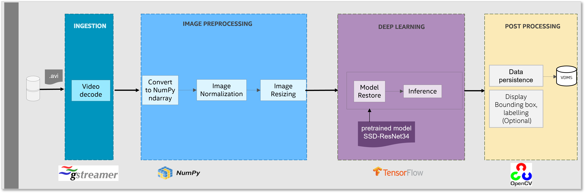

# **Video Streamer**
## Overview

The video streamer pipeline is designed to mimic real-time video analytics. Real-time data is provided to an inference endpoint that executes single-shot object detection. The metadata created during inference is then uploaded to a database for curation.

## Hot it works

* It's a Gstreamer Pipeline based multimedia framework.
  Gstreamer elements are chained to create a pipeline where Gstreamer handles the flow of metadata associated with the media.

* Use TensorFlow to Inference. Inference is implemented as a plugin of Gstreamer.

* OpenCV Image preprocessing (normalization, resize) and draw Bounding box, labelling
* VDMS to store uploading metadata to database
* The workflow uses BF16/INT8 precision in SPR which speeds up the inference time using Intel® AMX, without noticeable loss in accuracy when compared to FP32 precision (using Intel® AVX-512).

Video streamer data flow



## Get started

### **Prerequisites**

* Download the repo
```
git clone https://github.com/intel-innersource/frameworks.ai.end2end-ai-pipelines.video-streamer
```
* Prepare data and models

```
cd frameworks.ai.end2end-ai-pipelines.video-streamer
mkdir dataset
cd dataset
#download a sample video, or copy your own video to dataset folder 
wget https://github.com/intel-iot-devkit/sample-videos/raw/master/classroom.mp4
cd ..
mkdir models
cd models
#download pretrained ssd-resnet34 fp32 and int8 models
wget https://storage.googleapis.com/intel-optimized-tensorflow/models/v1_8/ssd_resnet34_fp32_1200x1200_pretrained_model.pb
wget https://storage.googleapis.com/intel-optimized-tensorflow/models/v1_8/ssd_resnet34_int8_1200x1200_pretrained_model.pb
```
The metadata created during inference will be uploaded to a database. The easiest way to setup a VDMS instance for database testing is using docker with the following command:
```
docker run --net=host -d vuiseng9/intellabs-vdms:demo-191220
```
By defualt, VDMS will attempt to use all threads available which can impact performance.  For testing here it seems that four cores is more than enough to handle data ingestion, so it is recommended that the database is pinned to the last 4 cores of the second socket on a multi-socket system. I.e. for a dual socket Xeon 8280:
```
numactl --physcpubind=52-55 --membind=1 docker run --net=host -d vuiseng9/intellabs-vdms:demo-191220
```

* Install conda

* Install numactl


### Set up

Please follow commands to install required software.

Go to the directory where you cloned the repo:
```
cd frameworks.ai.end2end-ai-pipelines.video-streamer
conda create -n vdms-test python=3.8
conda activate vdms-test
./install.sh
```

By default, this will install intel-tensorflow-avx512.  If it is necessary to run the workflow using a specific tensorflow, please update it in `requirements.txt`

### Configuration

* config/pipeline-settings for pipeline setting
Modify the parameter `gst_plugin_dir` and `video_path` to fit your Gstreamer plugin directory and input video path.

* config/settings.yaml for inference setting
Customize to choose FP32, AMPBF16 or INT8 for inference.

CPU Optimization settings are found in two files:

`config/pipeline-settings`
1. cores_per_pipeline
This controls CPU cores to run the whole pipeline.

`config/settings.yaml`
1. inter_op_parallelism : "2"
2. intra_op_parallelism : "4"
This control Tensorflow thread settings

### How to run

`run.sh` is configured to accept a single input parameter which defines how many separate instances of the gstreamer pipelines to run. The instances are pinned to $OMP_NUM_THREADS real processors and pinned to local memory. I.e, when running four pipelines with OMP_NUM_THREADS=4
|*Pipeline*|*Cores*|*Memory*|
| ---- | ---- | ---- |
|1| 0-3| Local |
|2| 4-7| Local |
|3| 8-11| Local |
|4|12-15| Local |

It is very important that the pipelines don't overlap numa domains or any other hardware non-uniformity.  These values must be updated for each core architecture to get optimum performance.

For launching the workload using a single instance, use the following command:
`./run.sh 1`

For launching 14 instances with 4 cores per instance on a dual socket Xeon 8280, just run `./run.sh 14`

# Recommended Hardware
The hardware below is recommended for use with this reference implementation.

| Recommended Hardware	| Precision |
| ---- | ---- |
| * Intel® 4th Gen Xeon® Scalable Performance processors |	BF16 |
| * Intel® 1st, 2nd, 3rd, and 4th Gen Xeon® Scalable Performance processors	| FP32 |

# Useful Resources
[Intel® AI Analytics Toolkit (AI Kit)](https://www.intel.com/content/www/us/en/developer/tools/oneapi/ai-analytics-toolkit.html)

# Support
E2E DLSA tracks both bugs and enhancement requests using Github. We welcome input, however, before filing a request, please make sure you do the following: Search the Github issue database.